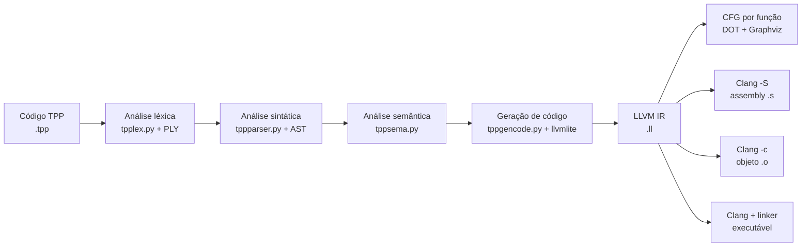

# Compilador TPP com LLVM

[](https://www.python.org/)
[](https://llvm.org/)
[](LICENSE)

Compilador acadêmico para a linguagem **TPP**, implementado em Python. O projeto recebe um programa `.tpp`, executa as análises léxica, sintática e semântica, gera **LLVM IR** com llvmlite e entrega o resultado ao **Clang/LLVM** para produzir assembly, código de máquina ou um executável nativo.

O objetivo é demonstrar, de ponta a ponta, como um front-end de compilador se conecta a um back-end real e multiplataforma.

## Contexto acadêmico

Este projeto foi desenvolvido na disciplina de **Compiladores** da **Universidade Tecnológica Federal do Paraná (UTFPR) – Campus Campo Mourão**. A gramática da linguagem utilizada no projeto foi fornecida pelo **Prof. Dr. Rogério Aparecido Gonçalves**, responsável por ministrar a disciplina.

Para aprender a escrever programas `.tpp`, consulte a **[gramática e o guia da linguagem TPP](GRAMATICA_TPP.md)**.

## Pipeline de compilação



O front-end deste repositório termina no arquivo `.ll`. A seleção de arquitetura, otimização, emissão de instruções e ligação do executável são realizadas pela toolchain LLVM/Clang.

## Funcionalidades

- lexer construído com PLY;
- parser LALR e construção de árvore sintática;
- análise semântica, tipos e tabela de símbolos;
- tipos `inteiro` e `flutuante`;
- variáveis escalares e vetores;
- funções, parâmetros e recursão;
- condicionais `se/senão` e laços `repita/até`;
- operações aritméticas, relacionais e lógicas;
- entrada e saída com `leia` e `escreva`;
- geração de LLVM IR com llvmlite;
- geração de CFG por função em DOT, PNG, SVG ou PDF;
- geração de código nativo pelo Clang para os targets disponíveis na instalação.

## Pré-requisitos

- Python 3.12 ou superior;
- Clang/LLVM para gerar assembly, objetos e executáveis;
- Graphviz para exportar imagens das árvores e renderizar CFGs em PNG, SVG ou PDF.

No Ubuntu/Debian:

```bash
sudo apt update
sudo apt install python3 python3-venv clang llvm graphviz
```

No Windows, o caminho mais simples é usar WSL. Os comandos abaixo assumem um terminal Linux ou macOS.

## Instalação

Clone o repositório e, na raiz do projeto, crie um ambiente virtual:

```bash
git clone https://github.com/gserbai/Compiler.git
cd Compiler

python3 -m venv .venv
source .venv/bin/activate
python -m pip install --upgrade pip
python -m pip install -r requirements.txt
```

Confirme a toolchain:

```bash
python --version
clang --version
clang --print-targets
```

## Execução rápida

O exemplo abaixo compila o programa de Fibonacci presente nos testes.

### 1. Gerar LLVM IR

```bash
python tppgencode.py tests/gencode-test-023.tpp
```

Em caso de sucesso, o gerador não imprime mensagens e cria:

```text
tests/gencode-test-023.tpp.ll
```

### 2. Gerar um executável nativo

```bash
mkdir -p build/demo
clang -O2 -Wno-override-module \
  tests/gencode-test-023.tpp.ll \
  -o build/demo/fibonacci
```

Sem `--target`, o Clang gera código para a arquitetura da própria máquina. Em um computador Linux x86-64, o resultado será um executável x86-64.

### 3. Executar

```bash
printf '5\n' | ./build/demo/fibonacci
```

Saída:

```text
1
1
2
3
5
1
1
2
3
5
```

## Executar cada etapa separadamente

Use o mesmo arquivo para observar as fases do compilador:

```bash
# Tokens reconhecidos
python tpplex.py tests/gencode-test-023.tpp

# Análise sintática e AST
python tppparser.py tests/gencode-test-023.tpp

# Análise semântica
python tppsema.py tests/gencode-test-023.tpp

# LLVM IR
python tppgencode.py tests/gencode-test-023.tpp
```

### Árvores sintática e semântica

Para exportar as árvores, instale o Graphviz e acrescente `-t` ao parser ou ao analisador semântico:

```bash
# AST completa
python tppparser.py -t tests/gencode-test-023.tpp

# AST podada após a análise semântica
python tppsema.py -t tests/gencode-test-023.tpp
```

O parser gera a árvore completa em `.dot`, `.png` e texto ASCII:

```text
tests/gencode-test-023.tpp.ast.dot
tests/gencode-test-023.tpp.unique.ast.dot
tests/gencode-test-023.tpp.unique.ast.png
tests/gencode-test-023.tpp.ascii_tree.txt
```

O analisador semântico gera a árvore podada:

```text
tests/gencode-test-023.tpp.pruned.ast.dot
tests/gencode-test-023.tpp.pruned.ast.png
```

## Gerar gráficos CFG

O script `gerar_cfg.py` aceita diretamente um fonte `.tpp` ou um LLVM IR `.ll`. Para compilar o exemplo de Fibonacci e gerar um CFG em DOT e PNG para cada função:

```bash
python gerar_cfg.py tests/gencode-test-023.tpp
```

As saídas são organizadas por programa:

```text
tests/gencode-test-023.tpp.ll
build/cfg/gencode-test-023/fibonacciRec.dot
build/cfg/gencode-test-023/fibonacciRec.png
build/cfg/gencode-test-023/fibonacciIter.dot
build/cfg/gencode-test-023/fibonacciIter.png
build/cfg/gencode-test-023/main.dot
build/cfg/gencode-test-023/main.png
```

O arquivo DOT sempre é gerado. Para trabalhar sem Graphviz ou escolher outro formato:

```bash
# Somente DOT, sem dependência do executável dot
python gerar_cfg.py tests/gencode-test-023.tpp --format dot

# SVG ou PDF
python gerar_cfg.py tests/gencode-test-023.tpp --format svg
python gerar_cfg.py tests/gencode-test-023.tpp --format pdf

# CFG simplificado, sem listar as instruções LLVM dentro dos blocos
python gerar_cfg.py tests/gencode-test-023.tpp --hide-instructions
```

Também é possível gerar os gráficos a partir de um IR existente:

```bash
python gerar_cfg.py tests/gencode-test-023.tpp.ll --format png
```

Para gerar os CFGs de todos os LLVM IR válidos criados pelo script de executáveis:

```bash
bash gerar_executaveis_tpp.sh
for ir in tests/*.tpp.ll; do
    python gerar_cfg.py "$ir" --format png
done
```

## LLVM IR, assembly e código de máquina

Estes artefatos representam etapas diferentes:

| Artefato | Comando | Significado |
| --- | --- | --- |
| `programa.tpp.ll` | `python tppgencode.py programa.tpp` | representação intermediária textual do LLVM |
| `programa.s` | `clang -S programa.tpp.ll -o programa.s` | assembly específico da arquitetura |
| `programa.o` | `clang -c programa.tpp.ll -o programa.o` | código de máquina relocável, ainda sem ligação |
| `programa` | `clang programa.tpp.ll -o programa` | executável ligado para o sistema-alvo |

### x86-64 explicitamente

Gerar assembly e objeto x86-64:

```bash
mkdir -p build/x86_64

clang --target=x86_64-unknown-linux-gnu -O2 -S \
  -Wno-override-module tests/gencode-test-023.tpp.ll \
  -o build/x86_64/fibonacci.s

clang --target=x86_64-unknown-linux-gnu -O2 -c \
  -Wno-override-module tests/gencode-test-023.tpp.ll \
  -o build/x86_64/fibonacci.o
```

O arquivo `.o` já contém instruções de máquina x86-64. Para inspecioná-las:

```bash
llvm-objdump -d build/x86_64/fibonacci.o
```

Se o host também for Linux x86-64, gere o executável diretamente com o comando da execução rápida.

### AArch64 ou RISC-V

O mesmo LLVM IR pode ser entregue a outro back-end instalado no Clang:

```bash
mkdir -p build

# Assembly AArch64
clang --target=aarch64-unknown-linux-gnu -O2 -S \
  -Wno-override-module tests/gencode-test-023.tpp.ll \
  -o build/fibonacci-aarch64.s

# Objeto RISC-V 64
clang --target=riscv64-unknown-linux-gnu -O2 -c \
  -Wno-override-module tests/gencode-test-023.tpp.ll \
  -o build/fibonacci-riscv64.o
```

`clang --print-targets` mostra os back-ends disponíveis. Gerar `.s` ou `.o` normalmente exige apenas suporte ao target; gerar e executar um binário para outra plataforma também exige linker, sysroot, bibliotecas C e ambiente de execução compatíveis. Isso é necessário porque `leia` e `escreva` usam `scanf` e `printf` no IR.

Consulte a documentação oficial sobre [a toolchain do Clang](https://clang.llvm.org/docs/Toolchain.html), [cross-compilation](https://clang.llvm.org/docs/CrossCompilation.html) e [`llvm-objdump`](https://llvm.org/docs/CommandGuide/llvm-objdump.html).

## Compilar todos os exemplos válidos

O script incluído gera novamente os arquivos `.ll` válidos e cria executáveis nativos em `build/executaveis/`:

```bash
bash gerar_executaveis_tpp.sh
```

O script usa o target padrão do computador. Alguns arquivos de `tests/` representam casos inválidos de entrada e, por isso, não produzem LLVM IR.

Os arquivos `.tpp.ll`, os executáveis, os CFGs, as imagens de árvores e os logs são gerados localmente e não fazem parte do repositório. Eles podem ser recriados a qualquer momento com os comandos acima.

## Testes

As suítes reproduzíveis possuem 35 casos de geração de código e 7 casos de CFG:

```bash
python -m pytest -q tppgencode_test.py cfg_test.py
```

Resultado esperado:

```text
42 passed
```

As suítes históricas de lexer, parser e semântica permanecem no repositório, mas seus arquivos de saída esperada não fazem parte deste snapshot. Por isso, use o comando específico acima para reproduzir a validação disponível.

## Estrutura do projeto

| Caminho | Responsabilidade |
| --- | --- |
| `tpplex.py` | análise léxica e definição de tokens |
| `tppparser.py` | gramática, parser LALR e AST |
| `tppsema.py` | análise semântica e árvore podada |
| `tppgencode.py` | geração de LLVM IR |
| `gerar_cfg.py` | geração de CFGs em DOT, PNG, SVG ou PDF |
| `mytree.py` | estruturas auxiliares da árvore |
| `myerror.py` | carregamento e formatação de diagnósticos |
| `ErrorMessages.properties` | catálogo de mensagens do compilador |
| `GRAMATICA_TPP.md` | gramática formal, sintaxe, exemplos e limitações da linguagem |
| `requirements.txt` | dependências Python necessárias para executar e testar |
| `tests/` | programas TPP e fixtures dos testes |
| `gerar_executaveis_tpp.sh` | automação IR → executáveis nativos |

## Escopo e possíveis evoluções

Este é um compilador educacional, não uma toolchain de produção. O projeto atualmente gera LLVM IR válido e delega otimização e seleção de instruções ao Clang, por exemplo com `-O2`.

Extensões naturais para o trabalho incluem passes próprios de otimização, análise de fluxo, computação aproximada no IR e validação contínua de targets como AArch64 e RISC-V.

## Licença

Distribuído sob a [licença Apache 2.0](LICENSE).
